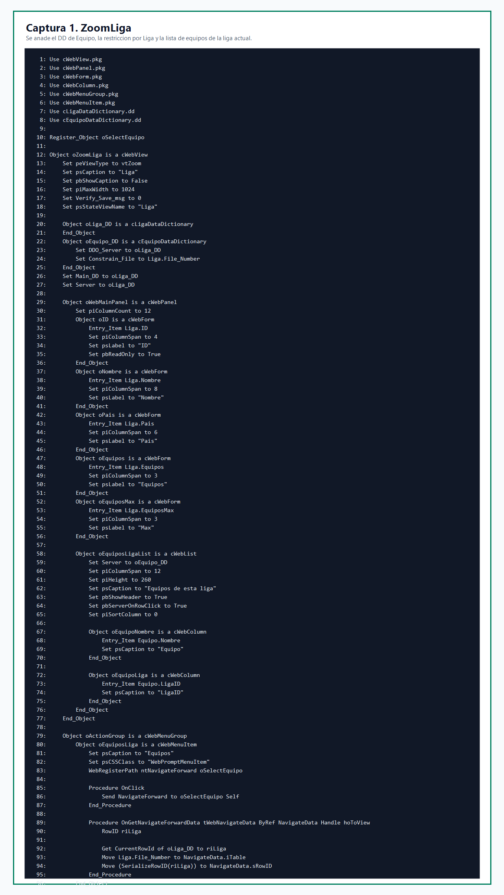
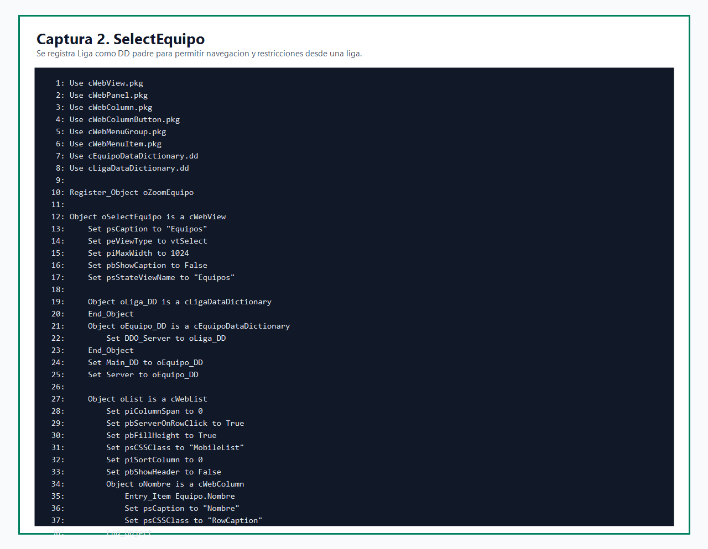
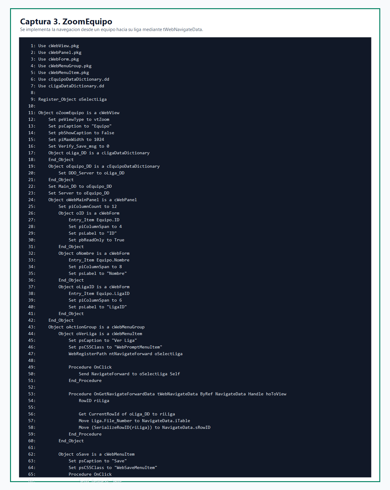
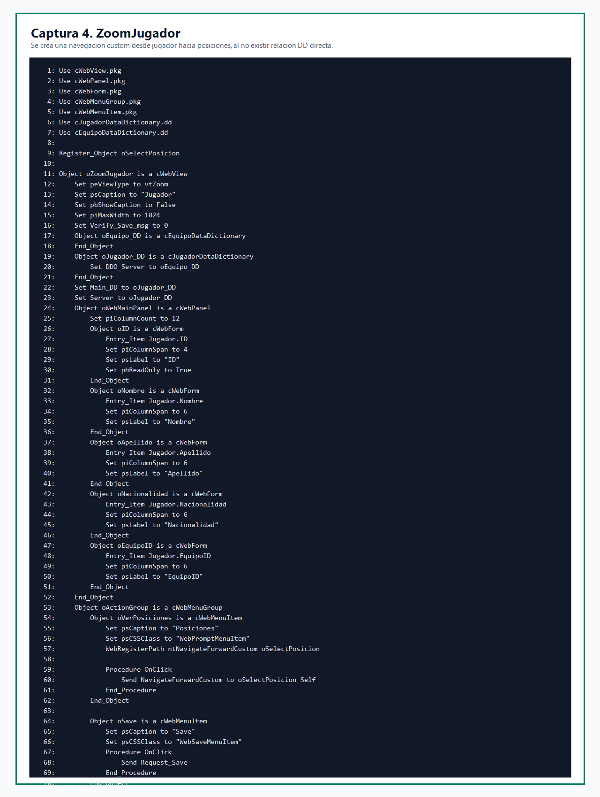
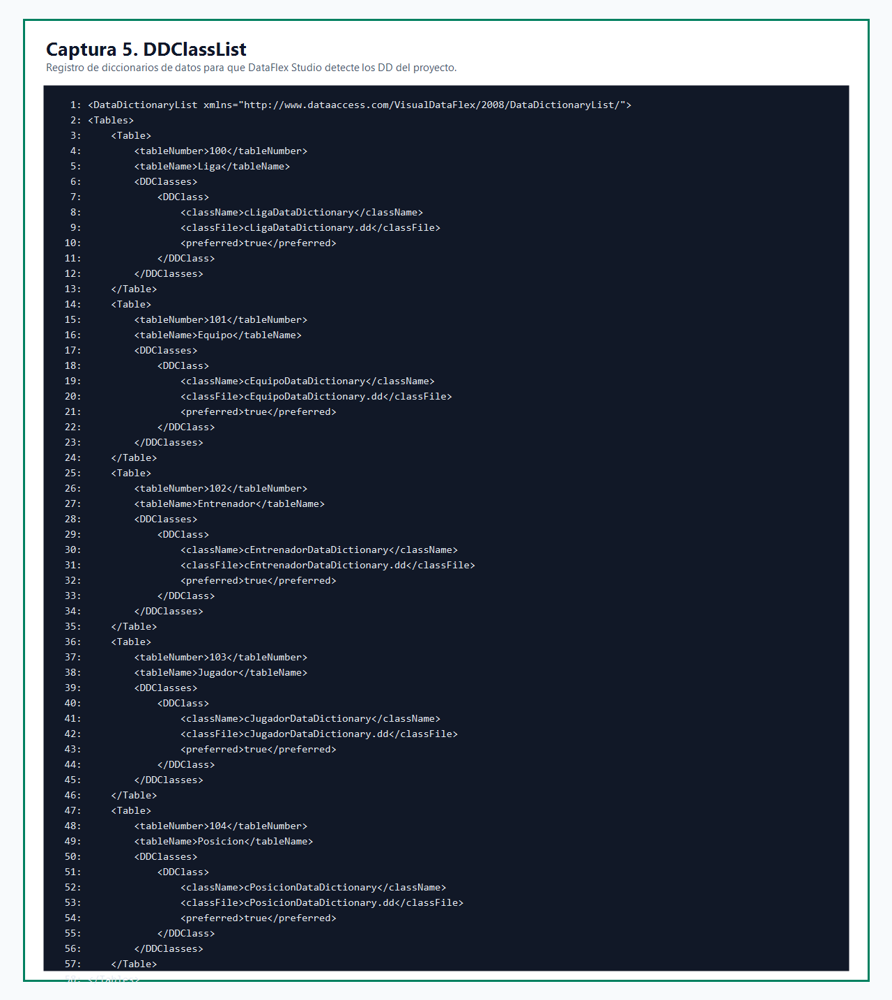
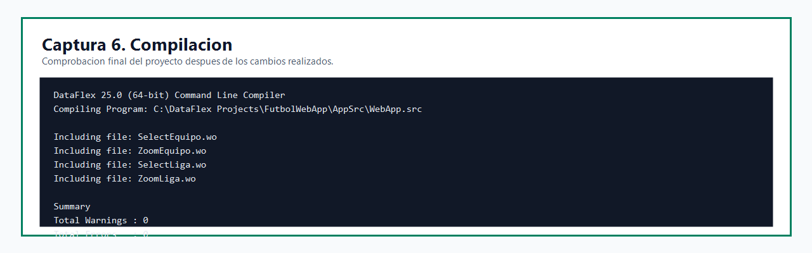

# Práctica de navegación en DataFlex

## 1. Introducción

En esta práctica se ha trabajado sobre el proyecto `FutbolWebApp`, una aplicación web desarrollada con DataFlex. El objetivo principal ha sido implementar y documentar distintos casos de navegación entre vistas `Select` y `Zoom`, utilizando los mecanismos propios de DataFlex: `NavigateForward`, `NavigateForwardCustom`, `WebRegisterPath` y la estructura `tWebNavigateData`.

También se ha corregido la configuración del proyecto para que DataFlex Studio reconozca correctamente los diccionarios de datos y la conexión a base de datos.

## 2. Objetivos de la práctica

- Revisar los participantes que intervienen en una navegación: vista invocadora, objeto invocador, vista invocada, objeto invocado y pila de navegación.
- Implementar navegaciones entre vistas relacionadas: `Liga`, `Equipo`, `Jugador` y `Posicion`.
- Usar `tWebNavigateData` para enviar información de navegación entre vistas.
- Añadir una relación padre-hijo entre `Liga` y `Equipo`.
- Registrar los diccionarios de datos del proyecto para que el entorno de DataFlex Studio los detecte correctamente.
- Verificar que el proyecto compila sin errores.

## 3. Desarrollo realizado

### 3.1. Navegación desde Liga hacia Equipos

En la vista `ZoomLiga.wo` se añadió el diccionario de datos de `Equipo` como hijo de `Liga`. Para ello se declaró `oEquipo_DD`, se enlazó con `oLiga_DD` mediante `DDO_Server` y se aplicó `Constrain_File` para limitar los equipos mostrados a la liga actual.

Además, se añadió una lista `oEquiposLigaList` dentro del propio zoom de liga. Esta lista permite ver directamente los equipos pertenecientes a la liga abierta.



### 3.2. Preparación de SelectEquipo como vista hija

En `SelectEquipo.wo` se añadió el DD de `Liga` para que `Equipo` pueda comportarse correctamente como tabla hija. Con esta modificación, la vista puede recibir una navegación desde una liga y mostrar únicamente los equipos relacionados.



### 3.3. Navegación desde Equipo hacia Liga

En `ZoomEquipo.wo` se implementó el botón `Ver Liga`. Este botón permite navegar desde el zoom de un equipo hacia la vista de selección de ligas.

Para realizarlo se obtiene el `RowId` de la liga actual y se asigna a `NavigateData.sRowID`. También se indica la tabla correspondiente mediante `NavigateData.iTable`.



### 3.4. Navegación custom desde Jugador hacia Posiciones

En `ZoomJugador.wo` se añadió el botón `Posiciones`. En este caso se utiliza `NavigateForwardCustom`, porque en el proyecto no existe una relación directa entre los DD de `Jugador` y `Posicion`.

La relación real entre jugadores y posiciones sería una relación muchos-a-muchos mediante una tabla intermedia. Como esa tabla no está modelada en las vistas actuales, se deja la navegación como custom.



### 3.5. Registro de diccionarios de datos

Al abrir el proyecto en DataFlex Studio aparecía el aviso de que no había diccionarios de datos definidos. Para solucionarlo se creó el archivo `DDSrc/DDClassList.xml`, donde se registran los DD principales del proyecto:

- `cLigaDataDictionary`
- `cEquipoDataDictionary`
- `cEntrenadorDataDictionary`
- `cJugadorDataDictionary`
- `cPosicionDataDictionary`



### 3.6. Conexión administrada a base de datos

También se añadió una conexión administrada llamada `FutbolDB` en `Data/DFConnId.ini`. Después se actualizaron los archivos `.int` para usar:

```text
SERVER_NAME DFCONNID=FutbolDB
```

De esta forma, el proyecto queda más integrado con las herramientas de DataFlex Studio para gestionar conexiones de base de datos.

## 4. Orden de eventos de navegación

De forma resumida, una navegación hacia delante en DataFlex sigue este orden:

1. Se ejecuta el `OnClick` del botón, menú o lista que inicia la navegación.
2. Se llama a `NavigateForward`, `NavigateForwardCustom` o `NavigatePath`.
3. DataFlex determina el tipo de navegación: `nfFromMain`, `nfFromParent`, `nfFromChild` o `nfUndefined`.
4. El objeto invocador rellena los datos mediante `GetNavigateForwardData`.
5. Se puede personalizar la información en `OnGetNavigateForwardData`.
6. La vista destino recibe la navegación y aplica restricciones o búsquedas.
7. Se ejecutan los eventos de visualización de la vista, como `OnLoad`, `OnBeforeShow` y `OnShow`, cuando correspondan.

## 5. Verificación

Después de realizar los cambios, se compiló el proyecto con el compilador de DataFlex 25.0. El resultado fue correcto, sin errores ni avisos.



## 6. Conclusión

La práctica ha permitido aplicar los conceptos principales de navegación en una aplicación web DataFlex. Se han implementado casos de navegación entre vistas relacionadas, se ha usado `tWebNavigateData` para transportar información entre vistas y se ha corregido la configuración del entorno para que DataFlex Studio reconozca los diccionarios de datos del proyecto.

El resultado final es un proyecto que compila correctamente y que refleja los casos pedidos en la práctica.
